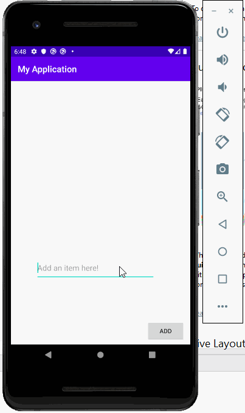

# Project 1 - *SimpleToDo*

**SimpleToDo** is an android app that allows building a todo list and basic todo items management functionality including adding new items, editing and deleting an existing item.

Submitted by: **Rose Li**

Time spent: **6** hours spent in total

## User Stories

The following **required** functionality is completed:

* [ ] User can **view a list of todo items**
* [ ] User can **successfully add and remove items** from the todo list
* [ ] User's **list of items persisted** upon modification and and retrieved properly on app restart

## Video Walkthrough

Here's a walkthrough of implemented user stories:

## Notes

Emulator is a little bit slow when building the app.

